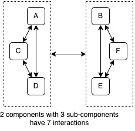
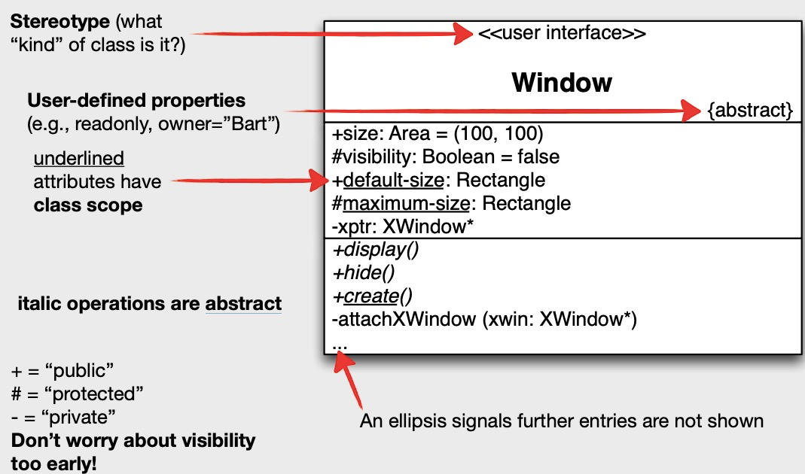
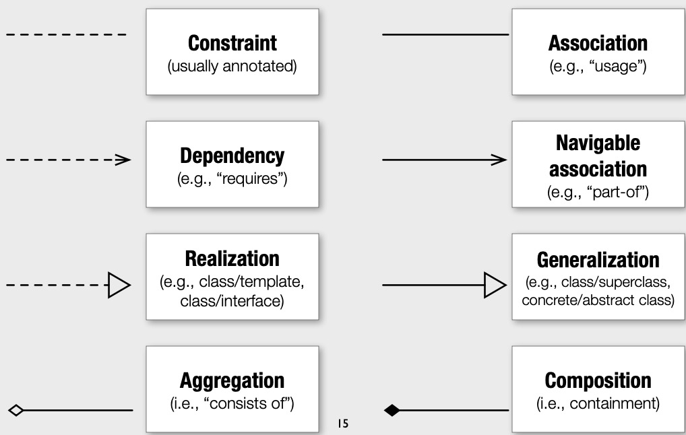
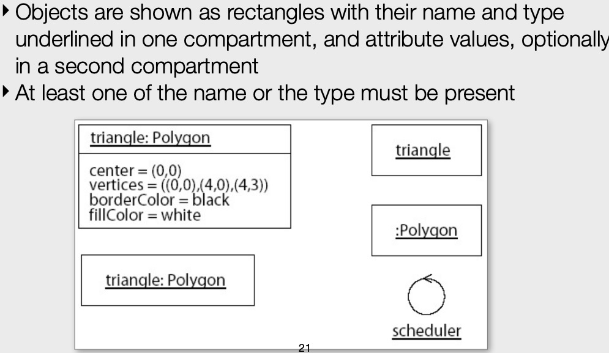
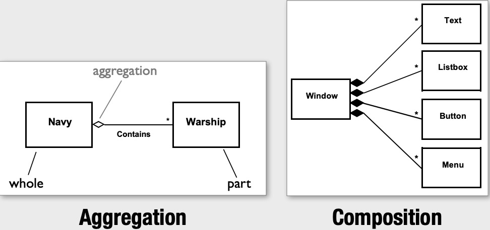

# CHAPTER 1 Introduction
the approach to design is based on three ideas:
- construct system out of pieces that interact in a small number of ways

- 'Making sense' depends on who we are
- programs are just another kind of data. Source code is just text. the advantage is: solve hard programs
in elegant ways. the disadvantage is increasing the level of abstraction in programs

# CHAPTER 2 Objects and Classes
**Why we need OOP(object-oriented programming)?**
- it is natural way to represent real-world 'thing' in code
- how can we organize code to make it easier to understand,test and extend
## 2.1 Objects
parent class can be treated as a **contract**, children class should provide the name and methods with the name
suggest.

**Polymorphism(多态)**： children classes(square and circle) have the same methods. the advantage is ** reducing cognitive
load** and **extensibility**

An object is a special kind of dictionary and a method is just a function that takes an object of the right kind as its first
parameter(typically called self in Python)
## 2.2 Classes
```Python
def square_perimeter(thing):
    return 4 * thing["side"]

def square_area(thing):
    return thing["side"] ** 2
#class相当于一个method的字典
Square = {
    'perimeter':square_perimeter,
    'area':square_area,
    '_classname':'Square' #注意：这个Square是字符串 
}
#Constructor:注意如何确定是哪个class的构造函数呢？
def square_new(name,side):
    return {
        'name':name,
        'side':side,
        '_class':Square 
            }

def call(thing, method_name):
    return thing["_class"][method_name](thing)

examples = [square_new("sq", 3), circle_new("ci", 2)]
for ex in examples:
    n = ex["name"]
    p = call(ex, "perimeter")
    a = call(ex, "area")
    c = ex["_class"]["_classname"]
    print(f"{n} is a {c}: {p:.2f} {a:.2f}")
```
## 2.3 Arguments
** what's the difference between argument and parameter?**

parameters are part of the definition, while arguments are given when the function is called

**\*args**: capture any 'extra' values passed to the function

**\*\* kwargs** capture any extra named parameters
## 2.4 Inheritance
- the make(cls,*args) is responsible for upcalling the constructor of its parent
- 

```python
##重点：the make(cls,*args) is responsible for upcalling the constructor of its parent
def make(cls,*args):
    return cls['_new'](*args)


def square_new(name, side):
    return make(Shape, name) | {# | is used to combine two dictionaries:the constructor of its parent and itself
        "side": side,
        "_class": Square
    }

Square = {
    "perimeter": square_perimeter,
    "area": square_area,
    "_classname": "Square",
    "_parent": Shape,
    "_new": square_new
}


examples = [make(Square, "sq", 3), make(Circle, "ci", 2)] ## 注意：instance object 用的make
for ex in examples:
    n = ex["name"]
    d = call(ex, "density", 5)
    print(f"{n}: {d:.2f}")
```

# CHAPTER 6
## 6.1 Storing and Running Tests
**Pass**：the test subject works as expected

**Fail**: something is wrong with the test subject, raise `AssertionError`

**Error**: something is wrong in the test itself, we don't know if the thing we're testing is working properly
or not. raise other kind of exception

```python
def run_tests(all_tests):
    results = {"pass": 0, "fail": 0, "error": 0}
    for test in all_tests:
        try:#重新不停，一个错不影响下面执行
            test()
            results["pass"] += 1
        except AssertionError:
            results["fail"] += 1
        except Exception:
            results["error"] += 1
    print(f"pass {results['pass']}")
    print(f"fail {results['fail']}")
    print(f"error {results['error']}")
```
The disadvantage of function above:
- function runs tests in the order they appear in the list, an early test can affect the behavior of other tests
- Making lists of functions is error-prone and clumsy

## 6.2 Finding Functions
**globals** is a dictionary containing all the variables in the program's global scope

**introspection** Having a running program find things in itself
# CHAPTER 7 An Interpreter
**Parser**: translate the source code into a data structure

**runtime**: execute the instructions in that data structure

A compiler translates a program into runnable instructions before the program runs,
while an interpreter generates instructions on the fly as the program is running
## 7.1 Expressions & 7.3 Introspection
```python
def do(expr):
    # Integers evaluate to themselves.
    if isinstance(expr, int):
        return expr

    # Lists trigger function calls.
    assert isinstance(expr, list)
    if expr[0] == "abs":
        return do_abs(expr[1:])
    if expr[0] == "add":
        return do_add(expr[1:])
    assert False, f"Unknown operation {expr[0]}"
```
This lookup-and-call process is called **dynamic dispatch**, since the program
decides who to give work to on the fly

The **disadvantages** of codes above:
- error-prone: maybe forget to add some methods or maybe add them twice
- duplicate code

**how to solve the problem?**
By using **introspection** to create a lookup table that store every function whose
name starts with 'do_'
```python
OPS = {
    name.replace('do_',''):func
    for name,func in globals().items()
    if name.startswith('do_')
}

def do(env,expr):
    if isinstance(expr,int):
        return int
    
    assert isinstance(expr,list)
    assert expr[0] in OPS,f"Unknown operation {expr[0]}"
    func = OPS[expr[0]]
    return func(env,expr[1:])
```

**recursion** having a function call itself either directly or indirectly

## 7.2 Variables 
```python
def do_seq(env, args):
    assert len(args) > 0
    for item in args:
        result = do(env, item)
    return result
```
This function is a **control flow**: it controls when and how other expressions
are evaluated

# CHAPTER 8 Functions and Closures
## 8.1 Definition and Storage
**Anonymous function** : A function without a name, such as **lambda expressions**
## 8.2 Calling Functions
**Eager evaluation**: Evaluating a function's arguments before we run it
**Lazy evaluation**: pass the argument sub-lists into the function and let it 
evaluate them when it needed their values.

**what is the call stack of a program?**
the environment in a form of list of dictionaries, each dictionary is called
**stack frame**. why we need this? to prevent **name collision**

**dynamic scoping**： searching through all active stack frames for a varibale. easy to implement
**Lexical scoping**: figures out what a variable name refers to based on the 
structure of the program text. easy to understand

```python
def do_fuc(env,args):
    assert len(args)==2
    params = args[0]
    body = args[1]
    return ['func',params,body]

def do_call(env,args):
    #set up the call
    assert len(args)>=1
    name = args[0]
    values = [do(env,a) for a in args[1:]]
  
   # Find the function.
    func = env_get(env, name)
    assert isinstance(func, list) and (func[0] == "func")
    params, body = func[1], func[2]
    assert len(values) == len(params)

    # Run in new environment.
    env.append(dict(zip(params, values))) #create a new stack frame
    result = do(env, body) #execute the instructions
    env.pop() #pop the frame off the stack

    # Report.
    return result
```
## 8.3 Closures
```python
def make_hidden(thing):
    def __inner():
        return thing
    return __inner
```
**Closure**:make data private
**Common use of closures**: turn a function that needs many arguments into
one that needs fewer

# CHAPTER 9 Protocols
## 9.1 Mock Objects
**mock objects**: Temporary replacements， easy to control and predict

when a object has a `__call__`, then obj() is automatically turned into
obj.__call__(..)
```python
class Adder:
    def __init__(self, value):
        self.value = value

    def __call__(self, arg):
        return arg + self.value

add_3 = Adder(3)
result = add_3(8)
print(f"add_3(8): {result}") #add_3(8): 11
```
## 9.2 Protocols
**Protocols**: a rule that specifies how programs can tell python to do specific things
at specific moments.

**context manager**: managing mock objects, replaces the real function with mock
at the start of a block of code and then puts the original back at the end.The protocol
relies on two methods`__enter__`and`__exit__`
- `def __enter__(self):`: __enter__ doesn’t take any extra parameters: anything it needs must be provided via the object’s constructor
- `def __exit__(self, exc_type, exc_value, exc_traceback):`:__exit__ will always be called with three values that tell it whether an exception occurred, and if so, what the exception was. 
## 9.3 Decorators
**Decorator**:wrap one function with another
注意：closure 和 decorator的关系
```python
def original(value):
    print(f"original:{value}")
def logging(func): #注意参数是function
    def _inner(value):
        func(value)
    return _inner

original = logging(original)
original("example")
```
Using a closure also give us a way to pass extra arguments when create the wrapped function
```python
def wrap(func):
    def _inner(*args):
        print("before call")
        func(*args)
        print("after call")
    return _inner

@wrap
def original(message):
    print(f"original: {message}")

original("example")
```
If we want to pass arguments at the time we apply the decorator
```python
def decorator(func, label):
    def _inner(arg):
        print(f"entering {label}")
        func(arg)
    return _inner

@decorator("message")
def double(x):           # equivalent to
    return 2 * x         # double = decorator(double, "message")
 ```
## 9.4 Iterators
**Iterator protocol**:
- has an `__iter__` method to create an iterator
- **must** have a `__next__` method, which must return a value each time it
is called. When there are no more values to return, it must raise a **StopIteration**
exception
```python
class NaiveIterator:
    def __init__(self, text):
        self._text = text[:]

    def __iter__(self):
        self._row, self._col = 0, -1
        return self

    def __next__(self):
        self._advance()
        if self._row == len(self._text):
            raise StopIteration
        return self._text[self._row][self._col]
    
    def _advance(self):
        if self._row < len(self._text):
            self._col += 1
            if self._col == len(self._text[self._row]):
                self._row += 1
                self._col = 0
```
# CHAPTER 16 Object Persistence
## 16.1 Built-in Types & ## 16.2 Converting to Classes
在`save()`中注意:set list and dictionary 和 string,前三个中每一个元素的存入需要用到 recursive`
print的是类型：长度。 String注意要用newline分开，然后打印

在`load()`中 set list and dictionary 和 string 用for loop + recursive 
```python
def save(writer,thing):
    if isinstance(thing,bool):
        print(f"bool:{thing}",file = writer)
    elif isinstance(thing,float):
        print(f"float:{thing}",file=writer)
    elif isinstance(thing,int):
        print(f"int:{thing}",file=writer)
        
        # [save_str]
    elif isinstance(thing, str):
        lines = thing.split("\n")
        print(f"str:{len(lines)}", file=writer)
        for line in lines:
            print(line, file=writer)
    # [/save_str]

    # [save_list]
    elif isinstance(thing, list):
        print(f"list:{len(thing)}", file=writer)
        for item in thing:
            save(writer, item)
    # [/save_list]

    # [save_set]
    elif isinstance(thing, set):
        print(f"set:{len(thing)}", file=writer)
        for item in thing:
            save(writer, item)
    # [/save_set]

    # [save_dict]
    elif isinstance(thing, dict):
        print(f"dict:{len(thing)}", file=writer)
        for (key, value) in thing.items():
            save(writer, key)
            save(writer, value)
    # [/save_dict]
    else:
        raise ValueError(f"unknown type of thing {type{thing}")

def load(reader):
    line = reader.readline()[:-1]# strip off the newline at the end
    assert line,'Nothing to read'
    fields = line.split(":",maxsplit=1)
    assert len(fields) == 2,f"Badly-formed line {line}"
    key,value = fields
    
    if key == 'bool':
        names = {'True':True,'False':False}
        assert value in names, f"Unknown Boolean {value}"
        return names[value]
    elif key == 'float':
        return float(value)
    elif key == "int":
        return int(value)
    
     # [extras]
    elif key == "str":
        lines = [reader.readline()[:-1] for _ in range(int(value))]
        return "\n".join(lines)

    # [load_list]
    elif key == "list":
        return [load(reader) for _ in range(int(value))]
    # [/load_list]

    elif key == "set":
        return {load(reader) for _ in range(int(value))}

    elif key == "dict":
        result = {}
        for _ in range(int(value)):
            k = load(reader)
            v = load(reader)
            result[k] = v
        return result

    else:
        raise ValueError(f"unknown type of thing {line}")
```
the drawback of the codes above: if we want to extend it, we have to modify its internals.
and volated the **Open-closed Principle**, which means software should be open for extension but closed for modification

To solve this problem, we write them as class.
the`SaveObjects.save()`to figure out which method to call to save a particular method based on the name of the thing's type
```python
class SaveObjects:
    def __init__(self, writer):
        self.writer = writer

    def save(self, thing):
        typename = type(thing).__name__ ##重点
        method = f"save_{typename}"
        assert hasattr(self, method), \
            f"Unknown object type {typename}"
        getattr(self, method)(thing)
```
```python
class LoadObjects:
    def __init__(self, reader):
        self.reader = reader

    def load(self):
        line = self.reader.readline()[:-1]
        assert line, "Nothing to read"
        fields = line.split(":", maxsplit=1)
        assert len(fields) == 2, f"Badly-formed line {line}"
        key, value = fields
        method = f"load_{key}"
        assert hasattr(self, method), f"Unknown object type {key}"
        return getattr(self, method)(value)
```
**hasattr(obj, "name")**: tell us whether the object has an attribution/method called 'name',**getattr(obj,'name') return
the value of attribution/function 
**StringIO class** allow us to read from strings and write to them 
use the functions we normally use to read and write files. **run tests 
don't need to create lots of files**

**the dedent()** remove leading indentation from the body of a string
**make the test easier to read**

## 16.3 Aliasing
Using the ID function to keep track of things, then the above codes can be
```python
class SaveAlias(SaveObjects):
    def __init__(self, writer):
        super().__init__(writer)
        self.seen = set()

    def save(self, thing):
        thing_id = id(thing)#重点：读取ID
        if thing_id in self.seen:
            self._write("alias", thing_id, "")#写入ID
            return

        self.seen.add(id(thing))
        typename = type(thing).__name__
        method = f"_{typename}"
        assert hasattr(self, method), f"Unknown object type {typename}"
        getattr(self, method)(thing)

```
```python
class LoadAlias(LoadObjects):
    def __init__(self, reader):
        super().__init__(reader)
        self.seen = {}

    def load(self):
        line = self.reader.readline()[:-1]
        assert line, "Nothing to read"
        fields = line.split(":", maxsplit=2)
        assert len(fields) == 3, f"Badly-formed line {line}"
        key, ident, value = fields

        # the lines below contain a bug/没看懂这个bug
        if key == "alias":
            assert ident in self.seen
            return self.seen[ident]

        method = f"load_{key}"
        assert hasattr(self, method), f"Unknown object type {key}"
        result = getattr(self, method)(value)
        self.seen[ident] = result
        return result

# to fix the bug above
        if key == "alias":
            assert ident in self.seen
            return self.seen[ident]

        method = f"load_{key}"
        assert hasattr(self, method), f"Unknown object type {key}"
        return getattr(self, method)(ident, value)
```
# CHAPTER 17 Binary Data
## 17.1 Integers
The drawbacks of represent intergers like this: 01001:+9 and 11001:-9
- it gives us two zeroes, one positive and one negative
- the hardware is more complicated

**hexadecimal**:
- the digits 0–9 have the usual meaning
- the letters A–F (or a–f) are used to represent the digits 11–15
- prefix:0x

what is 0xF7: 15*16+7=247 base 10(10j进制的247)
## 17.2 Bitwise Operations
- **&(and)**: yields a '1' only if both its inputs are '1'
- **|(or)**: yields a '1' either or both are '1'
- **^(xor)**: produce 1 if the bits are different
- **~(not)**: 1 becomes 0, and 0 becomes 1
- **1100 << 2**:110000
- **1100>>2**:0011

## 17.3 Text
**Character encoding**: a standard that specifies how characters are
represented in memory.

what's the problem if per character use 16 or 32 bits:
- existing text files using ANSI have to be transcribed
- documents would be two or four times larger

to solve the problem of ANSI,Unicode can be used

the most popular encoding is UTF-8,which is variable length 


## 17.4 And Now, Persistence
Three reasons to store data in formats that people can't easily read:
- Size
- Speed
- Lack of anything better

**open(filename,'rb')**：'rb' return back the file's contents as bytes
object instead of as character strings

**struct** module packs and unpacks data for us.
- pack(format, val_1, val_2, …):pack values into a bytes object
- unpack(format,string):return a tuple containing the unpacked values

**How can we tell pack() to pack all the data that's there regardless of length?**
```python
def pack_string(as_string):
    as_bytes = bytes(as_string, "utf-8")
    header = pack("i", len(as_bytes))
    format = f"{len(as_bytes)}s"
    body = pack(format, as_bytes)
    return header + body


def unpack_string(buffer):
   header, body = buffer[:4], buffer[4:]
   length = unpack("i", header)[0]
   format = f"{length}s"
   result = unpack(format, body)[0]
   return str(result, "utf-8")
```

**calcsize()** figure out how large (in bytes) the data represented by a format is

# CHAPTER 23 A File Viewer
Four classes:
- Window: draw lines and report its size
- Buffer:
  - store lines of text
  - keep track of a viewpoint
  - transform buffer coordinates to screen coordinates
- Cursor:
  - know its position in the buffer
  - move up,down,left and right
- App: makes a window, a buffer and a cursor. then maps keys to actions


## 23.1 Curses
**Curse** handles interaction with text terminals on different operating systems in a uniform way
`cursers.wrapper()`:
- takes a function with a single parameter as input
- does some setup
- call that function with an object that acts as an interface to the screen

**repr**: a newline character shows up in the file as '\n' rather than as a blank line

```python
import curses
def main(stdscr):
    while True:
        key = stdscr.getkey()

if __name__ == '__main__':
    curses.wrapper(main)
```

```python
LOG = None

def open_log(filename):
    global LOG
    LOG = open(filename, "w")

def log(*args):
    print(*args, file=LOG)
#有上面的代码后修改下面的main()
def main(stdscr):
    while True:
        key = stdscr.getkey()
        util.log(repr(key))
        if key.lower() == "q":
            return

if __name__ == "__main__":
    util.open_log(sys.argv[1])
    curses.wrapper(main)

```
those codes above for capturing what the user is typing

**重点在代码注释中**
```python
def main(stdscr, lines):
    while True:
        stdscr.erase() ##clear the screen, this is a problem: it erases the entire screen each time the user presses a key,it is unnecessary
        for (y, line) in enumerate(lines):
            stdscr.addstr(y, 0, line) # increase values of Y move down 
        key = stdscr.getkey() # wait for a keystroke
        if key.lower() == "q":
            return
```
## 23.2 Windowing
**Window** class for knowing how big the screen is and only displays lines that fit inside it
```python
class Window:
    def __init__(self, screen):
        self._screen = screen

    def draw(self, lines):
        self._screen.erase()
        for (y, line) in enumerate(lines):
            if 0 <= y < curses.LINES:
                self._screen.addstr(y, 0, line[:curses.COLS])
# [/window]

# [main]
def main(stdscr, lines):
    window = Window(stdscr)
    #重点
    # create a window object, what can't create it earlier and pass it into main as we do with lines?
    #because the constructor of Window needs the screen object which doesn't exist until curser.wrapper calls main
    ## this is an example of **delayed construction**
    window.draw(lines)
    while True:
        key = stdscr.getkey()
        if key.lower() == "q":
            return
# [/main]

if __name__ == "__main__":
    num_lines, logfile = int(sys.argv[1]), sys.argv[2]
    lines = make_lines(num_lines)
    open_log(logfile)
    curses.wrapper(lambda stdscr: main(stdscr, lines))
```

set the size of the window
```python
class Window:
    def __init__(self, screen, size):
        self._screen = screen
        if size is None:
            self._nrow = curses.LINES
            self._ncol = curses.COLS
        else:
            self._nrow, self._ncol = size

    def draw(self, lines):
        self._screen.erase()
        for (y, line) in enumerate(lines):
            if 0 <= y < self._nrow:
                self._screen.addstr(y, 0, line[:self._ncol])
```

## 23.3 Moving @ ## 23.4 Refactoring
to solve the problem that we cann't see any of the text outside the window, define `Cursor` class to 
teach the application to scroll. to keep track of the position of a cursor

```python
class Cursor:
    def __init__(self):
        self._pos = [0, 0]

    def pos(self):
        return tuple(self._pos) # other code can't modify it

    def up(self): self._pos[ROW] -= 1

    def down(self): self._pos[ROW] += 1

    def left(self): self._pos[COL] -= 1

    def right(self): self._pos[COL] += 1


def main(stdscr, size, lines):
    window = Window(stdscr, size)
    cursor = Cursor()
    while True:
        window.draw(lines)
        # why we need '*' here?
        # because stdscr.move() take two arguments but cursor.pos() return a two-element tuple, we 
        # spread the latter with * to satisfy the former
        stdscr.move(*cursor.pos())
        key = stdscr.getkey()
        if key == "KEY_UP": cursor.up()
        elif key == "KEY_DOWN": cursor.down()
        elif key == "KEY_LEFT": cursor.left()
        elif key == "KEY_RIGHT": cursor.right()
        elif key.lower() == "q":
            return
```
the codes above still have some problems. we still can't see all the lines in a long 'file': the
text doesn't scroll down when we go to the bottom

how to solve the problem?
- write a class to represent the application as a whole, which will create one instance of this class,
own the window and cursor
```python
import curses
import sys

from util import COL, ROW, start
from cursor_const import Window
from move_cursor import Cursor

# [main]
class MainApp:
    def __init__(self, size, lines):
        self._size = size
        self._lines = lines

    def __call__(self, screen):
        self._setup(screen)
        self._run()

    def _setup(self, screen):
        self._screen = screen
        self._window = Window(self._screen, self._size)
        self._cursor = Cursor()
# [/main]

# [run]  handle interaction
    def _run(self):
        while True:
            self._window.draw(self._lines)
            self._screen.move(*self._cursor.pos())
            key = self._screen.getkey()
            if key == "KEY_UP": self._cursor.up()
            elif key == "KEY_DOWN": self._cursor.down()
            elif key == "KEY_LEFT": self._cursor.left()
            elif key == "KEY_RIGHT": self._cursor.right()
            elif key.lower() == "q":
                return
# [/run]

# refactor _run to handle keystrokes using dynamic dispatch instead of a long chain of if/elif statement
        def __init__(self, size, lines):
            super().__init__(size, lines)
            self._running = True
    
    
    def _run(self):
        while self._running:
            self._window.draw(self._lines)
            self._screen.move(*self._cursor.pos())
            self._interact()

TRANSLATE = {
    "\x18": "CONTROL_X"
}

def _interact(self):
    key = self._screen.getkey()
    key = self.TRANSLATE.get(key, key)
    name = f"_do_{key}"
    if hasattr(self, name):
        getattr(self, name)()

def _do_CONTROL_X(self):
    self._running = False

def _do_KEY_UP(self):
    self._cursor.up()

def _do_KEY_DOWN(self):
    self._cursor.down()

def _do_KEY_LEFT(self):
    self._cursor.left()

def _do_KEY_RIGHT(self):
    self._cursor.right()
# refactor


# [launch]
if __name__ == "__main__":
    size, lines = start()
    app = MainApp(size, lines)
    curses.wrapper(app)
# [/launch]
```
**Factory Methods** will make the constructor longer but allows us to override them one by one

## 23.5 Clipping

don't let the cursor go above line 0, and don't let the cursor go below the last line, those will make
sure the cursor not move outside the window  or outside the displayed text.

```python
class ClipCursor(Cursor):
    #why we need to take the buffer as constructor argument?
    # it can ask how many rows there are and how big each one is
    def __init__(self, buffer): 
        super().__init__()
        self._buffer = buffer

    def up(self):
        self._pos[ROW] = max(self._pos[ROW]-1, 0)

    def down(self):
        self._pos[ROW] = min(self._pos[ROW]+1, self._buffer.nrow()-1)

    def left(self):
        self._pos[COL] = max(self._pos[COL]-1, 0)

    def right(self):
        self._pos[COL] = min(
            self._pos[COL]+1,
            self._buffer.ncol(self._pos[ROW])-1
        )
```

## 23.6 Viewpoint
**Viewpoint** class to track the currently-visible portion of the buffer.
```python
# [cursor]
class ViewportCursor(ClipCursorFixed):
    def __init__(self, buffer, window):
        super().__init__(buffer)
        self._window = window

    def left(self):
        super().left()
        self._fix()

    def right(self):
        super().right()
        self._fix()

    def _fix(self):
        self._pos[COL] = min(
            self._pos[COL],
            self._buffer.ncol(self._pos[ROW]) - 1,
            self._window.size()[COL] - 1
        )
# [/cursor]

class ViewportBuffer(ClipBuffer):
    def __init__(self, lines):
        super().__init__(lines)
        self._top = 0 # keep track of the top-most visible line
        self._height = None # keep track of the height of the window

    def lines(self):
        return self._lines[self._top:self._top + self._height]

    def set_height(self, height):
        self._height = height

    def _bottom(self):
        return self._top + self._height
# [/buffer]

    # [transform]: transforms the cursor's position from buffer coordinates to screen coordinates
    def transform(self, pos):
        result = (pos[ROW] - self._top, pos[COL])
        return result
    # [/transform]

    # [scroll]:move _top up or down when we reach the edge of the display
    def scroll(self, row, col):
        old = self._top
        if (row == self._top - 1) and self._top > 0:
            self._top -= 1
        elif (row == self._bottom()) and \
             (self._bottom() < self.nrow()):
            self._top += 1
    # [/scroll]

# [app]
class ViewportApp(ClipAppFixed):
    def _make_buffer(self):
        self._buffer = ViewportBuffer(self._lines)

    def _make_cursor(self):
        self._cursor = ViewportCursor(self._buffer, self._window)

    def _run(self):
        self._buffer.set_height(self._window.size()[ROW])
        while self._running:
            self._window.draw(self._buffer.lines())
            screen_pos = self._buffer.transform(self._cursor.pos())
            self._screen.move(*screen_pos)
            self._interact()
            self._buffer.scroll(*self._cursor.pos())
# [/app]

if __name__ == "__main__":
    size, lines = start()
    app = ViewportApp(size, lines)
    curses.wrapper(app)

```

# CHAPTER 24
## 24.1 Getting Started
**Headless application**: GUI application that don't display anything 

takes a list of keystrokes as input to simulate interaction with the user。
## 24.2 Insertion and Deletion
update **buffer** class
```python
class InsertDeleteBuffer(Buffer):
    def insert(self, pos, char):
        assert 0 <= pos[ROW] < self.nrow()
        assert 0 <= pos[COL] <= self.ncol(pos[ROW])
        line = self._lines[pos[ROW]]
        line = line[:pos[COL]] + char + line[pos[COL]:]
        self._lines[pos[ROW]] = line

    def delete(self, pos):
        assert 0 <= pos[ROW] < self.nrow()
        assert 0 <= pos[COL] < self.ncol(pos[ROW])
        line = self._lines[pos[ROW]]
        line = line[:pos[COL]] + line[pos[COL] + 1:]#delete the character **under** the cursor
        self._lines[pos[ROW]] = line
```
update **APP** class:
- define the set of characters that can be inserted 
```python
class InsertDeleteApp(HeadlessApp):
    INSERTABLE = set(string.ascii_letters + string.digits)

    def _make_buffer(self):
        self._buffer = InsertDeleteBuffer(self._lines)
```
- create handlers for insertion and deletion
```python
def _do_DELETE(self):
    self._buffer.delete(self._cursor.pos())

def _do_INSERT(self, key):
    self._buffer.insert(self._cursor.pos(), key)
```
- since we don’t want to have to add one handler for each insertable character, let’s write a _get_key method that 
returns a pair of values. The first indicates the “family” of the key, while the second is the actual key.
```python
def _get_key(self):
    key = self._screen.getkey()
    if key in self.INSERTABLE:
        return "INSERT", key
    else:
        return None, key

def _interact(self):
    family, key = self._get_key()
    if family is None:
        name = f"_do_{key}"
        if hasattr(self, name):
            getattr(self, name)()
    else:
        name = f"_do_{family}"
        if hasattr(self, name):
            getattr(self, name)(key)
    self._add_log(key)
```
## 24.3 Going Backward
in order to undo things we have to :
- keep track of actions and reverse them
- keep track of state and restore it

**the Command design pattern** : turn verbs into nouns
# CHAPTER 25 A Virtual Machine
## 25.1 Architecture
the vm simulates a computer with three parts:
- **the instruction point(IP)** hold the memory address of the next instruction to execute
- Four **registers** named R0 to R3 that instructions can access directly. everything happens in or 
through registers
- 256 **words** of memory

**instruction set** defines what it can do ,instructions are just numbers, we will write them in a
simple text format called **assembly code** that gives those number human-readable names
```python
NUM_REG = 4  # number of registers
RAM_LEN = 256  # number of words in RAM

OPS = {
    "hlt": {"code": 0x1, "fmt": "--"},  # Halt program
    "ldc": {"code": 0x2, "fmt": "rv"},  # Load value
    "ldr": {"code": 0x3, "fmt": "rr"},  # Load register
    "cpy": {"code": 0x4, "fmt": "rr"},  # Copy register
    "str": {"code": 0x5, "fmt": "rr"},  # Store register
    "add": {"code": 0x6, "fmt": "rr"},  # Add
    "sub": {"code": 0x7, "fmt": "rr"},  # Subtract
    "beq": {"code": 0x8, "fmt": "rv"},  # Branch if equal
    "bne": {"code": 0x9, "fmt": "rv"},  # Branch if not equal
    "prr": {"code": 0xA, "fmt": "r-"},  # Print register
    "prm": {"code": 0xB, "fmt": "r-"},  # Print memory
}

OP_MASK = 0xFF  # select a single byte
OP_SHIFT = 8  # shift up by one byte
OP_WIDTH = 6  # op width in characters when printing
```
putting all the constants that define a system in one file instead of scattering them across multiple files makes
**them easier to find as well as ensuring consistency**

## 25.2 Execution
重点见代码注释
```python
class VirtualMachine:
    def __init__(self):
        self.initialize([]) #重点：if an object has a method to reset or reinitialize itself,
        #having its constructor use this method is a way to avoid duplicating code
        self.prompt = ">>"

    def initialize(self, program):
        assert len(program) <= RAM_LEN, "Program too long"
        self.ram = [
            program[i] if (i < len(program)) else 0
            for i in range(RAM_LEN)
        ]
        self.ip = 0
        self.reg = [0] * NUM_REG

# to execute the next instruction
    def fetch(self):
        instruction = self.ram[self.ip]
        self.ip += 1
        op = instruction & OP_MASK
        instruction >>= OP_SHIFT
        arg0 = instruction & OP_MASK
        instruction >>= OP_SHIFT
        arg1 = instruction & OP_MASK
        return [op, arg0, arg1]
# fetch instructions and executes them until told to stop
    def run(self):
        running = True
        while running:
            op, arg0, arg1 = self.fetch()
            if op == OPS["hlt"]["code"]:
                running = False
            elif op == OPS["ldc"]["code"]:
                self.reg[arg0] = arg1
            elif op == OPS["ldr"]["code"]:
                self.reg[arg0] = self.ram[self.reg[arg1]]
            elif op == OPS["cpy"]["code"]:
                self.reg[arg0] = self.reg[arg1]
            else:
                assert False, f"Unknown op {op:06x}"
```

## 25.3 Assembly Code
One thing the assembly language has that the instruction set doesn't is **labels** on the addresses
in memory
## 25.4 Arrays
array to deal with the problem that each value needs a unique name
```python
## by using `.data` on a line to mark the start of the data section
## label：number to give a region a name and allocate some storage space
DIVIDER = ".data"
# split the lines into instructions and data allocations
def assemble(self, lines):
    lines = self._get_lines(lines)
    to_compile, to_allocate = self._split(lines)

    labels = self._find_labels(lines)
    instructions = [ln for ln in to_compile if not self._is_label(ln)]

    base_of_data = len(instructions)
    self._add_allocations(base_of_data, labels, to_allocate)

    compiled = [self._compile(instr, labels) for instr in instructions]
    program = self._to_text(compiled)
    return program

def _split(self, lines):
    try:
        split = lines.index(self.DIVIDER)
        return lines[0:split], lines[split + 1:]
    except ValueError:
        return lines, []

# figure out where each allocation lies and create a label accordingly
def _add_allocations(self, base_of_data, labels, to_allocate):
    for alloc in to_allocate:
        fields = [a.strip() for a in alloc.split(":")]
        assert len(fields) == 2, f"Invalid allocation directive '{alloc}'"
        lbl, num_words_text = fields
        assert lbl not in labels, f"Duplicate label '{lbl}' in allocation"
        num_words = int(num_words_text)
        assert (base_of_data + num_words) < RAM_LEN, \
            f"Allocation '{lbl}' requires too much memory"
        labels[lbl] = base_of_data
        base_of_data += num_words
```

# CHAPTER 26 A Debugger
## 26.1 One step at a Time
**reverse lookup table**  it is built from OPS table in `architecture.py`, so that it's always in 
sync with the table we're using to construct operations. for consistence and avoiding forget modify
```python
OPS_LOOKUP = {value['code']:key for key,value in OPS.items()}
```

## 26.2 Testing
```python
class Writer:
    def __init__(self):
        self.seen = []

    def write(self, *args):
        self.seen.extend(args)
```
```python
class Reader:
    def __init__(self, *args):
        self.commands = args
        self.index = 0

    def __call__(self, prompt): #don't need to wait the user to type in 
        assert self.index < len(self.commands)
        self.index += 1
        return self.commands[self.index - 1]
```
```python
def test_disassemble():
    # create a program to test
    source = """
    hlt
    """
    #create Reader to supply the commands
    reader = Reader("d", "q")
    #create Writer to capture the program's output
    writer = Writer()
    #Run the program in a fresh VM with that reader and writer
    execute(source, reader, writer)
    # check that the output captured in the writer is correct
    assert writer.seen == ["hlt | 0 | 0\n"]
```

## 26.3 Extensibility
```python
def __init__(self, reader=input, writer=sys.stdout):
    super().__init__(reader, writer)
    self.handlers = {
        "d": self._do_disassemble,
        "dis": self._do_disassemble,
        "i": self._do_ip,
        "ip": self._do_ip,
        "m": self._do_memory,
        "memory": self._do_memory,
        "q": self._do_quit,
        "quit": self._do_quit,
        "r": self._do_run,
        "run": self._do_run,
        "s": self._do_step,
        "step": self._do_step,
    }
```
create a lookup table like this makes the class easier to extend,don't need to modify `interact`
## 26.4 Breakpoints
**Breakpoint** to tell the computer to stop at a particular location and drop us into the debugger

Two ways to implement breakpoints:
- easiest way: store breakpoints addresses in a set, modify`run` to check that set each time it was supposed
to fetch a new instruction, and stop if it was at one of those addresses
- (more efficient)add a new instruction to architecture called brk.when the user sets a breakpoint at some address,
replace the instruction at that address with a breakpoint instruction and store the original in a 
lookup table. if the user later clears the breakpoint,copy the original instruction back into place.
if the VM encounters a breakpoint instruction while it is running, it drops into interactive mode.
```python
def _do_add_breakpoint(self, addr):
  #判断内存中的指令是否是断点的指令
    if self.ram[addr] == OPS['brk']['code']:
        return True
  #将内存原值存到一个字典中
    self.breaks[addr] = self.ram[addr]
  #将断点指令存在内存中
    self.ram[addr] = OPS['brk']['code']
    return True

def _do_clear_breakpoint(self, addr):
    if self.ram[addr] != OPS["brk"]["code"]:
        return True
    self.ram[addr] = self.breaks[addr]
    del self.breaks[addr]
    return True
```
重点在注释中
```python
def show(self):
  # to display what we've seen so far before adding more information 
  # tow advantages：
  #- save typing 
  #- ensure that changes in the parent class automatically show up in the child class 
    super().show()
    if self.breaks:
        self.write("-" * 6)
        for key, instruction in self.breaks.items():
            self.write(f"{key:06x}: {self.disassemble(key, instruction)}")
```

# UML
## UML Overview
**UML(Unified Modeling Language)** is not a method. It for team communication
**Why UML?**
- Reduces risks by documenting assumptions
- industry standars
- well-defines
- Open

## Classes attributes and operation

## UML Lines and Arrows

## Parameterized Classes,Interfaces and Utilities
## Objects, Associations


## Inheritance
## Constraints and Contracts


# Java basics
Java is quilker than python
COMPILERD:
.java-->bytecode(.javac)-->JRE-->JVM-->COMPUTER
```Java
public class Main{
  public static int add(int a, int b){
    return a + b
  }


  public static void main(String[] arg){
    String name = "Alice"; #注意变量的定义，每次变量的定义都需要声明类型
    final int b = 2;#b 不能再修改
    
    ##数据类型转化
    float a = 123;
    int c = (int)a + b;
    
    System.out.println("Hello,world");#注意最后的'；'
    
    #实例化class
    Book.lengthOfISBN();
    System.out.println(Book.totalBooks);
    Book b = new Book("Java is fun");
    System.out.println(b.getTitle());
  }
  }
```
'c': 单引号是字符
"c":双引号是字符串
protected:同一个package的可以访问

```Java
#supercalss:abstrct class defines the structure of class,but don't provide implementation
public abstract class Book{
  final private String title;
  public static int totalBooks = 0; #static意味着类属于class，不属于Object
  #constructor
  public Book(String aTitle){
      this.tile = aTitle;
      totalBooks = totalBooks +1;
  }
  #this method is implemented by subclasses
  public abstract String getAuthore();
  public String getTitle(){
    return this.title;
  }
  public static int lengthOfISBN(){
    return 18;
  
  }

}
#继承类
public class CourseBook extends Book{

  public CourseBook(String aTitle){
      super(aTitle);
  
  }
}

@Override


```
# A File Viewer in Java
